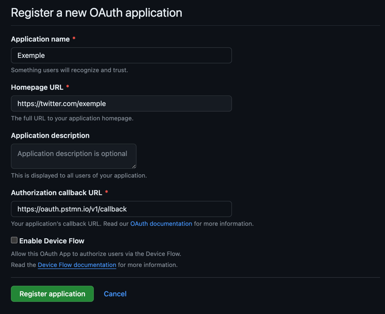

# TP API REST

## Objectif

Lors de ce TP, nous allons créer une API qui utilisera l'API de github afin de simplifier certaines opérations que nous
pouvons être amené à faire régulièrement.

## Pré-requis

Assurez-vous d'avoir les éléments ci-dessous :

- Java >= 21  [Lien d&#39;installation](https://jdk.java.net/21/)

```shell
# Vérification
java --version
```

- Git

```shell
# Vérification
git --version
```

## 1 - Commençons par déclarer notre API à Github

Tout le monde peut créer une application liée à l'API de Github. La seule condition est d'avoir un compte Github.

- Connectez-vous à votre compte Github puis rejoignez les [***Developer Settings***](https://github.com/settings/apps)
- Dans le menu à gauche, allez dans OAuth Apps puis cliquez sur ***New Oauth App*** :


- Une fois sur le formulaire, ajoutez `https://oauth.pstmn.io/v1/callback` aux champs **Authorization callback URL**,
  puis remplir le reste des informations comme vous le souhaitez :

  
- Vous pouvez valider votre création.
- Une fois cela fait, récupérez votre client ID sur lequelle vous arrivez et garder le bien au chaud.
- Générez également un client secrets puis garder le pour une étape ultérieur
  

[***Documentation***](https://docs.github.com/en/apps/oauth-apps/building-oauth-apps/creating-an-oauth-app)

## 2 - Vérification de l’application Spring boot

- Dans le répertoire du projet, lancez la commande `mvn clean install`
- Pour lancer l'application, vous pouvez utiliser la commande `mvn spring-boot:run`
- Vérifier que l'application se lance bien

## 3 - Configuration de postman pour Oauth2

Lorsque nous souhaitons communiquer avec l'API de Github, certains Endpoint sont protégés. Comme vu en cours, il est
nécessaire de suivre une
procédure d'authentification afin d'obtenir un ***token*** qui nous permettra d'utiliser ces endpoints.
Généralement lorsqu'on développe des APIs, on développe aussi des applications ***frontend*** qui interagissent ces
APIs.
Aujourd'hui, nous allons nous concentrer sur la partie API et allons utiliser postman comme ***client*** pour intéragir
avec notre API.

- Téléchargez et installer Postman. [Lien de téléchargement](https://www.postman.com/downloads/)
- Ouvrez Postman, puis connectez-vous à votre compte.
- Rendez-vous ensuite dans votre espace de travail puis créer une collection du nom de ***Cours Api***
- Cliquez sur la collection nouvellement créée puis créer une requête
- Allez ensuite dans la section ***Authorization*** de la requête :
  
- 
- Sélectionner le Type Oauth 2.0 puis dans ***Configure New Token***, remplissez les champs comme suit :
  - Cocher la case ***Authorize using browser***
  - Remplissez le champ Auth URL avec la valeur : `https://github.com/login/oauth/authorize`
  - Remplissez le champ Token URL avec la valeur : `https://github.com/login/oauth/access_token`
  - Remplissez le champ Client ID avec la valeur que vous aviez récupéré dans ***l'étape 1***
  - Remplissez le champ Client Secrets avec la valeur que vous aviez récupéré dans ***l'étape 1***

Vous devriez avoir cela à la fin :


- Vérifions que tout fonctionne bien. Cliquez sur le bouton ***Get New Access Token***.
  Vous devriez arriver sur la page de connection de Github avant d'être redirigé vers Postman où vous pourrez clicker
  sur `Use Token`.
  

C'est parfait notre environnement de travail est prêt, on peut commencer à coder.

## 4 - Récupération de la liste des projets de la personne connectée

En utilisant la documentation
disponible [ici](https://docs.github.com/en/rest/repos/repos?apiVersion=2022-11-28#list-repositories-for-a-user),
complétez la fonction `getProjects` de `ProjectService` afin de récupérer la liste des répository de
l'utilisateur connecté.

Pour valider:

- Faire un GET avec l'url `http://localhost:8081/projets`
- Vous devriez avoir la liste de vos projets github

## 5 - Créer un projet à partir d’un nom

En utilisant la documentation
disponible [ici](https://docs.github.com/en/rest/repos/repos?apiVersion=2022-11-28#create-a-repository-for-the-authenticated-user),
complétez la fonction `createProjet` de `ProjectService` afin de créer un projet privée à partir d'un nom et d'une
description.

Pour valider :

- Faire un POST avec l'url `http://localhost:8081/projets/exemple-cours-api`
- Un répository privé devrait être créé avec le nom `exemple-cours-api`

## 6 - Permettre l’invitation d’une liste de personne sur un projet spécifique

En utilisant la documentation
disponible [ici](https://docs.github.com/en/rest/collaborators/collaborators?apiVersion=2022-11-28#add-a-repository-collaborator),
complétez la fonction `inviteUsersToProject` de `ProjectService` afin d'inviter plusieurs personnes à un
***repository*** de la personne connecté à partir de leurs ***username***.
L'endpoint de Github nécessite le nom d'utilisateur du owner. Vous pouvez récupérer le username de l'utilisateur
connecté
à travers la méthode `getCurrentUsername` présente dans `UserService`.

Pour valider :

- Faire un POST avec
  l'url `http://localhost:8081/projects/add-user/exemple-cours-api?user=username-dun-ami&user=autre-username`

## 7 - Endpoint permettant de créer un projet puis d’y ajouter des gens en une fois

Afin de gagner du temps sur les manipulations que nous avons l'habitude de faire, complétez la
fonction `initiateProject` de `ProjectService` pour que celle-ci permette de créer un projet et d'y inviter en même
temps une liste de personnes.
L'endpoint de Github nécessite le nom d'utilisateur du owner. Vous pouvez récupérer le username de l'utilisateur
connecté
à travers la méthode `getCurrentUsername` présente dans `UserService`.

Pour valider :

- Faire un POST avec
  l'url `http://localhost:8081/projects/initiate/exemple-cours-api-2?user=username-dun-ami&user=autre-username`
- Un répository privé devrait être créé avec le nom `exemple-cours-api-2` et plusieurs personnes.

## Bonus : Réaliser un endpoint permettant de supprimer un projet à partir du nom de celui-ci

Toute la documentation nécessaire est
disponible [ici](https://docs.github.com/en/rest/repos/repos?apiVersion=2022-11-28#delete-a-repository).

Attention dans postman, lors de la récupération du token, vous devrez utiliser un scope `delete_repo` comme expliqué
dans la documentation.
L'endpoint de Github nécessite le nom d'utilisateur du owner. Vous pouvez récupérer le username de l'utilisateur
connecté
à travers la méthode `getCurrentUsername` présente dans `UserService`.
